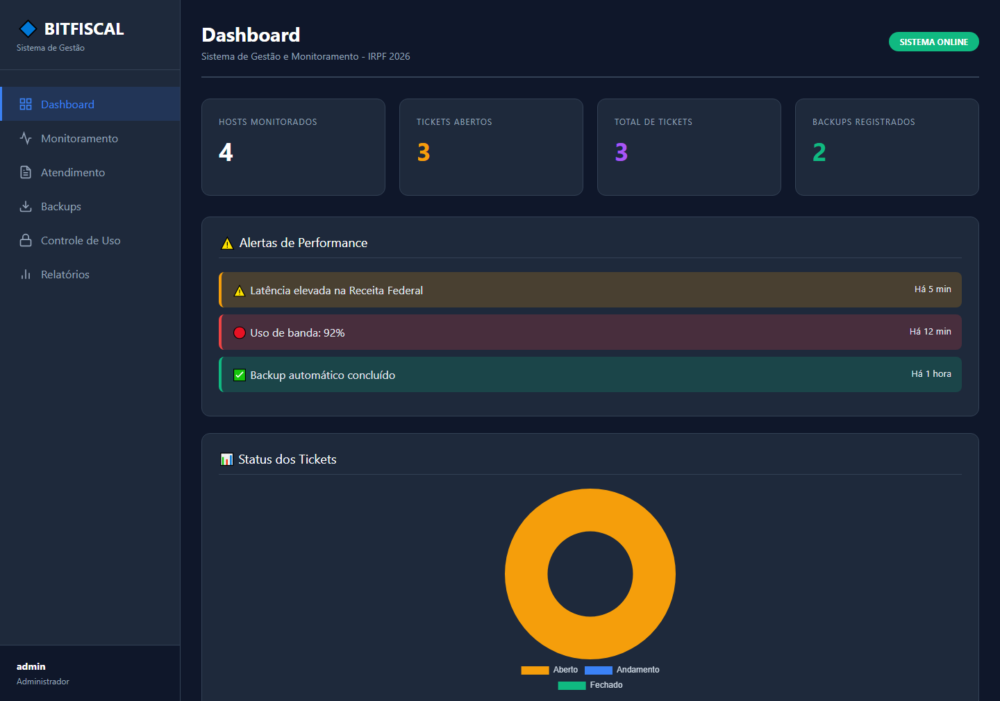
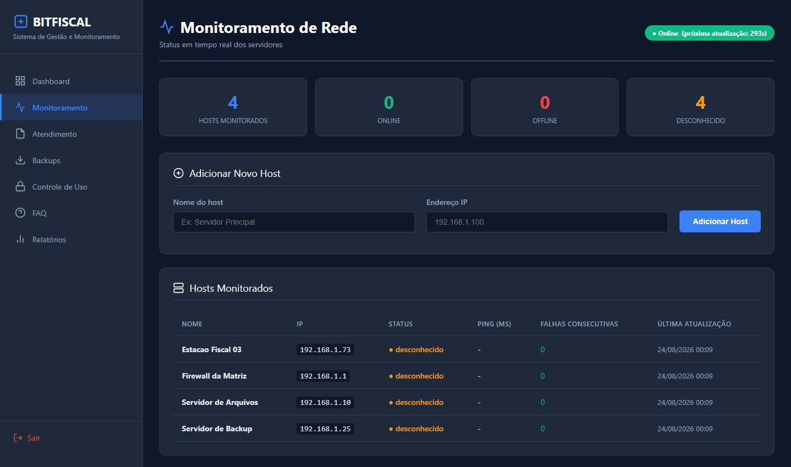
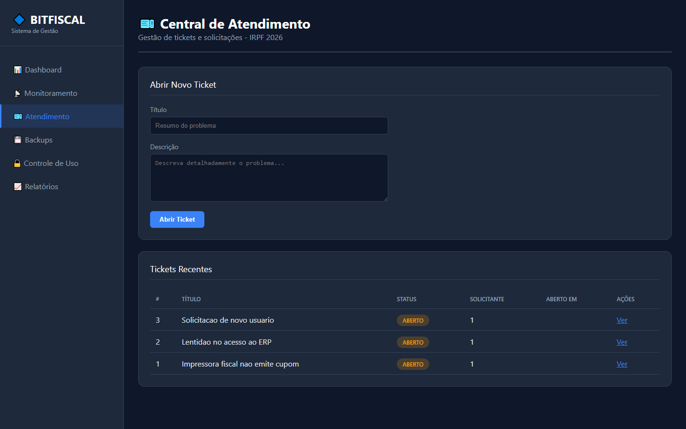

# BitFiscal


Plataforma web de **gestão de TI e serviços gerenciados** para micro e pequenas
organizações. Reúne, em um único ambiente multiempresa (multi-tenant), as
funções essenciais de suporte e infraestrutura, com autenticação, controle de
acesso por papéis e agendamento de tarefas.

Construída em **FastAPI (Python)**.

## Funcionalidades

| Módulo | Descrição |
|---|---|
| **Dashboard** | Visão geral de hosts, chamados e backups |
| **Monitoramento** | Verificação periódica de disponibilidade de hosts (ping) |
| **Chamados (Helpdesk)** | Abertura, comentários, anexos e mudança de status |
| **Backups** | Registro e execução (rsync) de rotinas de backup |
| **Controle de Uso** | Regras de uso e bloqueio de domínios via `/etc/hosts` |
| **Base de Conhecimento / FAQ** | Busca de respostas para dúvidas recorrentes |
| **Relatórios** | Exportação de chamados em CSV, PDF e Excel |
| **Usuários** | Gestão de usuários e papéis (somente admin) |

**Segurança:** autenticação por token JWT (cookie httponly), senhas com hash
(pbkdf2-sha256), controle de acesso por papéis (RBAC — admin, gestor, operador)
e limitação de requisições (rate limiting) no login.

## Telas

| Dashboard | Monitoramento de rede |
|---|---|
|  |  |



## Arquitetura

```
        navegador
            │  HTML (Jinja2) + cookie httponly com o JWT
            ▼
┌───────────────────────────┐
│      FastAPI (app/)       │
│  main.py    rotas + views │
│  auth.py    JWT, hash     │
│  rbac.py    papéis        │
│  tenants.py isolamento    │
├───────────────────────────┤
│  services/                │
│  monitor · backup · uso   │
│  relatórios · FAQ         │
├───────────────────────────┤
│  SQLAlchemy → SQLite/PG   │
└───────────────────────────┘
            │
     APScheduler (jobs periódicos de monitoramento)
```

- **Multiempresa (multi-tenant):** cada registro carrega o `tenant_id`, e
  `tenants.py` restringe as consultas à empresa do usuário logado.
- **RBAC:** três papéis (admin, gestor, operador); a checagem fica no servidor
  e os templates só escondem o que o papel não pode fazer.
- **Sessão em cookie httponly:** o JWT não fica acessível ao JavaScript da
  página, o que fecha a porta para roubo de token via XSS.
- **Tarefas periódicas:** o APScheduler roda as verificações de host em
  segundo plano, dentro do mesmo processo da aplicação.

## O que este projeto demonstra

- **Backend em FastAPI** servindo aplicação completa (não só JSON): rotas,
  templates, upload de anexo e download de arquivo.
- **Autenticação e autorização de verdade** — hash de senha, expiração de
  token, rate limiting no login e permissão por papel.
- **Modelagem relacional** com SQLAlchemy, funcionando tanto em SQLite quanto
  em PostgreSQL sem mudar o código.
- **Geração de relatórios** em três formatos (CSV, PDF via reportlab e Excel
  via openpyxl) a partir das mesmas consultas.
- **Empacotamento** com Docker e blueprint de deploy pronto (`render.yaml`).

## Principais rotas

| Método | Rota | O que faz |
|---|---|---|
| `GET` | `/dashboard` | Visão geral: hosts, chamados e backups |
| `GET` `POST` | `/monitor` · `/monitor/add` | Lista e cadastra hosts monitorados |
| `GET` `POST` | `/tickets` · `/tickets/create` | Helpdesk: listagem e abertura |
| `POST` | `/tickets/{id}/comentar` · `/status` · `/anexar` | Andamento do chamado |
| `GET` `POST` | `/backups` · `/backups/executar` | Rotinas de backup (rsync) |
| `GET` `POST` | `/usage` · `/usage/regra` | Regras de uso e bloqueio de domínio |
| `GET` `POST` | `/faq` | Base de conhecimento |
| `GET` | `/reports/csv` · `/pdf` · `/excel` | Exportação de chamados |
| `GET` `POST` | `/users` · `/users/add` | Gestão de usuários (somente admin) |
| `GET` | `/health` | Verificação de saúde da aplicação |

## Requisitos

- Python 3.11+
- (Opcional) Docker e Docker Compose

## Como executar (local)

```bash
# 1. Ambiente virtual
python3 -m venv .venv
source .venv/bin/activate        # Windows: .venv\Scripts\activate

# 2. Dependências
pip install -r requirements.txt

# 3. Configuração
cp .env.example .env             # ajuste SECRET_KEY e demais variáveis

# 4. Subir a aplicação
uvicorn app.main:app --reload
```

Acesse http://127.0.0.1:8000 e faça login.

Na primeira execução, um banco SQLite (`bitfiscal.db`) é criado automaticamente
e um usuário administrador padrão é semeado:

- **Usuário:** `admin`
- **Senha:** `admin`

> Troque essa senha (ou crie um novo admin e remova o padrão) antes de usar em
> produção.

## Como executar (Docker)

```bash
docker compose up --build
```

A aplicação sobe em http://localhost:8000 usando PostgreSQL como banco.

## Deploy

O repositório já traz um blueprint do [Render](https://render.com) em
`render.yaml`: criar um Blueprint apontando para este repositório provisiona o
serviço a partir do `Dockerfile`, gera a `SECRET_KEY` e semeia o admin.

Por ser um backend com processo próprio, **não** roda em hospedagem estática
(GitHub Pages, Netlify) — precisa de um serviço com runtime de contêiner.

## Configuração

Todas as variáveis ficam no arquivo `.env` (veja `.env.example`). As principais:

- `SECRET_KEY` — chave para assinar os tokens JWT (obrigatório trocar).
- `DATABASE_URL` — SQLite (padrão) ou PostgreSQL.
- `COOKIE_SECURE` — defina `True` ao servir por HTTPS.

## Estrutura

```
app/
├── main.py            # Rotas e inicialização
├── auth.py            # Autenticação (JWT, hash de senha)
├── rbac.py            # Papéis e permissões
├── models.py          # Modelos SQLAlchemy
├── db.py              # Conexão e sessão
├── config.py          # Configurações (.env)
├── services/          # Monitoramento, backup, uso, relatórios, FAQ
├── templates/         # Páginas (Jinja2)
└── static/            # CSS e imagens
├── routes/            # Blueprints de rota
data/                  # Base de conhecimento (FAQ)
scripts/               # Utilitários operacionais (criar/resetar admin, migração)
```

## Observações

- O bloqueio de domínios (Controle de Uso) edita `/etc/hosts` e exige execução
  como root; sem privilégios, a regra é registrada mas não aplicada ao sistema.
- O monitoramento usa `ping` do sistema operacional.

## 📄 Licença

MIT — veja [LICENSE](./LICENSE).

---

Feito por **Iasmin Ribeiro de Souza** · [LinkedIn](https://www.linkedin.com/in/iasmin-ribeiro-de-souza-033536401) · [GitHub](https://github.com/IasminRDS)
